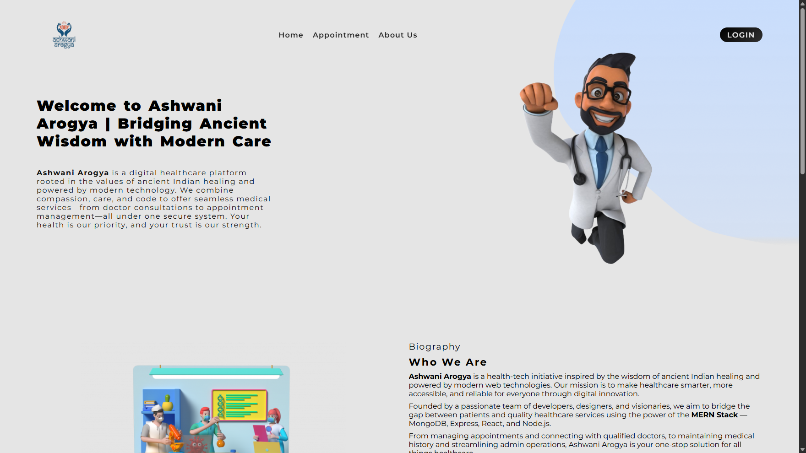
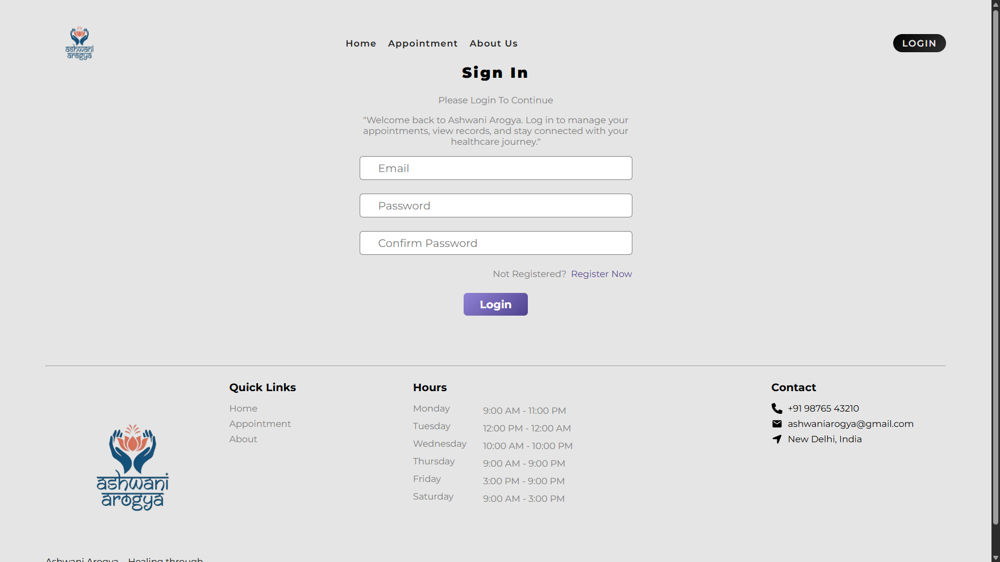
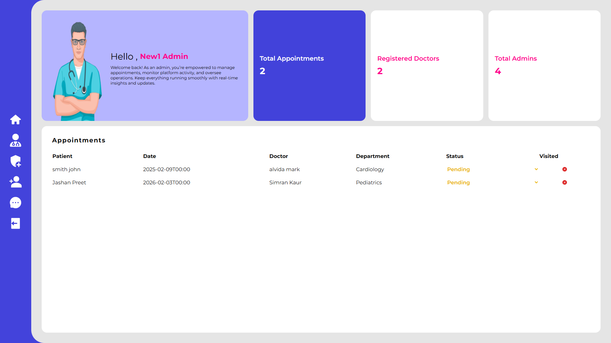
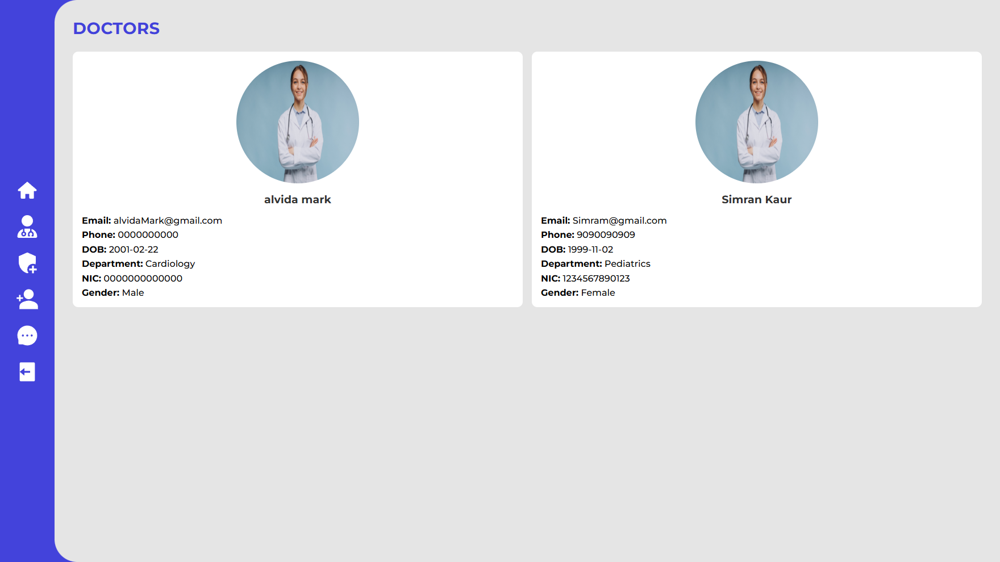
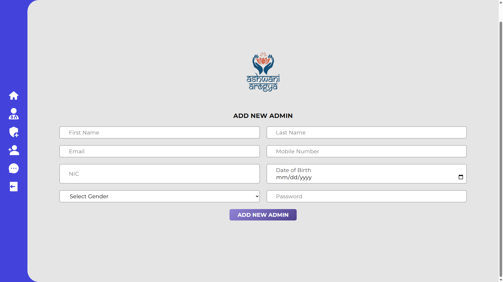
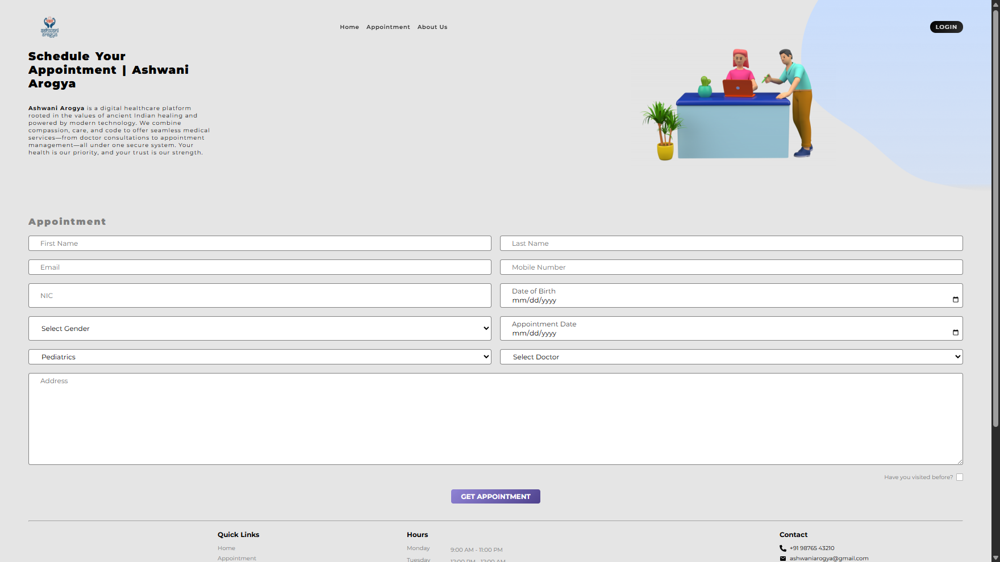

# 🏥 Ashwani Arogya

**Ashwani Arogya** is a modern, full-featured hospital management platform built with the **MERN Stack** (MongoDB, Express.js, React.js, Node.js). It enables **patients** to schedule appointments, **admins** to manage hospital operations, and **doctors** to track consultations — all in one seamless, responsive application.

---

## 🚀 Features

* 👩‍⚕️ **Doctor & Admin Login System**
* 🗕️ **Patient Appointment Booking**
* ✅ **Appointment Status Update** (Pending / Confirmed / Cancelled)
* 📊 **Admin Dashboard with Real-time Data**
* 📬 **Patient-Admin Messaging System**
* 🏥 **Department Overview Section**
* 📧 **Contact Form Integration**
* 🌐 **Responsive UI using React & Tailwind CSS**

---

## 📸 Screenshots









---

## 🛠️ Tech Stack

| Frontend     | Backend    | Database | Utilities   |
| ------------ | ---------- | -------- | ----------- |
| React.js     | Node.js    | MongoDB  | Axios       |
| React Router | Express.js | Mongoose | Toastify    |
| Tailwind CSS | JWT Auth   |          | React Icons |

---

## 📁 Project Structure

```
Ashwani-Arogya/
👉 backend/      # Express.js server & API routes
👉 dashboard/    # Admin dashboard views
👉 frontend/     # Patient & general frontend
👉 README.md     # Project overview
```

---

## 👨‍💼 Team & Contacts

| Name         | Role                 | LinkedIn                                              |
| ------------ | -------------------- | ----------------------------------------------------- |
| Varun Sammal | Full Stack Developer | [LinkedIn](https://www.linkedin.com/in/your-profile/) |
| John Doe     | Frontend Developer   | [LinkedIn](https://www.linkedin.com/in/your-profile/) |
| Jane Smith   | Backend Developer    | [LinkedIn](https://www.linkedin.com/in/your-profile/) |
| Rahul Kumar  | UI/UX Designer       | [LinkedIn](https://www.linkedin.com/in/your-profile/) |


---

## 🤝 Contributing

We welcome contributions!
If you find bugs or want to suggest new features, feel free to:

* Open an issue
* Submit a pull request
* Star 🌟 the repository to support us

---

## 🔧 Installation & Setup

```bash
# Clone the repo
git clone https://github.com/HackStreetBoy11/Ashwani-Arogya.git
cd Ashwani-Arogya

# Install frontend dependencies
cd frontend
npm install

# Install backend dependencies
cd ../backend
npm install

# Run backend server
npm run dev
```

> 💡 For the frontend, run `npm start` in the `frontend/` directory if needed.
